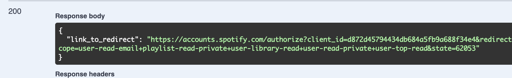

1. Go to http://localhost:50000/swagger/index.html
2. Select route /login/spotify. After execution you'll get 200 response with the "link_to_redirect". 

Copy that link and paste it into address line of your browser. You'll be redirected to Spotify log in page. Please, login. 
3. After login you'll be redirected to the SPOTIFY_REDIRECT_URL. For example, "https://translate.google.com". 

In the url parameters you'll find CODE and STATE. Copy them.
4. In swagger go to /callback/spotify route and paste there CODE and STATE as parameters in required fields and press Execute. 

You'll get 200 response with the "access_token". Copy it.
5. Go to /analyze route. In Authorization field paste this token with prefix "Bearer "(with the space after word to separate Bearer and access_token). Press execute and you'll get your top genres, top artists, and your archetype. 
